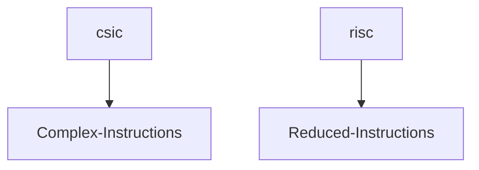

# Architecture

## Chapter 1 
###  2 classes of CPU architecture
___



# What is Assembly Programimng

Definition: An ASM program uses instructutions that correspond one-to-one with machine instructions
```code
mov rbx, rcx
// these are their respective codes for the machine to understand what command they are
104 28   29
// adds them 1042829
```
The programmer has great control over the program and great control over the machine

## Chapter 1.3 Benefits of Assembly

- know architecture
- know tool chain
    - editor, complier, linker. loader, debugger
- Better skill in algoritms
- Learn how to call functions
- Better understanding of I/O Buffer
- Better understanding of compliers

# Chapter 2

## Von Neumann machine

approx. 1995
## 5 Components
- processor
- fast storage (memory/cache)
- slow storage (harddrive)
- I/O devices (mouse/displays/keyboard)
- Bus (connects hardware)

A Quantum computer is not a Von Neumann machine

## Data Size

C++         Asm        Bytes    Bit
char        Byte        1       
short       Word        2
float, int  Double      4
double long Quad        8       64 bit
?           Octal       16      128 bit

CPU: Cache, ALU, FPU, GPRs

## GRPs 
16 registers = rax, rbx..
## FPU 
Float point unit 8 registers
- 1 register = 80 bits

## SSE 
16 registers = xmm0, xmm1, ... xmm15

## rax
- used for returning integers to other functions
- removing junk 
- sending count
- rax = 64 bits
- eax = 32 bits
- ax  = 16 bits
- al  = 8 bits

# Chapter 2. 4 Memory
Each byte has its own address

LSB: Least significant digit 
3 478 492

2 is the least sig digit

3 is MSD (most sig digit)

--> 3 478 000 rounding looses data at the LSD

## Hex numbers
9D 75 F4 63

9D is MSB

63 is LSB

Base 16 number:
752
7 x 16 ^2 + 5 x 16^1 + 2 x 16^0

0x752

Base 10 -> 1529

1529 / 16 = 

Little Endian number system to read in large numbers to store in addresses

Little Endian number system reads littlest numbers from the right to left

Big Endian number system reads the biggest numbers from the left to right

xor rbx. rbx results in all 0s
xorpd for xmm registers

ucompsd
jg continue
execute

jmp finish
continuse
execute